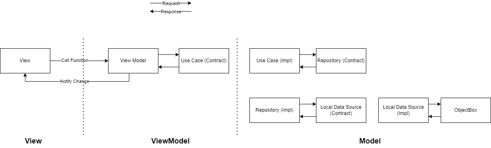

# Best Shop

A regular store which sell any item user need

# Architecture

## Getting Started

This project is a starting point for a Flutter application.

Run app :

- First run `flutter pub get` to get all dependencies
- Run this command to build all generated file `flutter pub run build_runner build`

## Used Plugin

- [flutter intl](https://plugins.jetbrains.com/plugin/13666-flutter-intl) to auto generate
  localization for the project, and also add new locale or remove existing locale easily.
- [flutter_assets_generater](https://plugins.jetbrains.com/plugin/15427-flutterassetsgenerator) to
  auto generate a new file `assets.dart` which contains all existing assets.

## Dependencies

- [flutter_svg 2.0.1](https://pub.dev/packages/flutter_svg)
- [provider 6.0.5](https://pub.dev/packages/provider)
- [objectbox 1.7.2](https://pub.dev/packages/objectbox)
- [objectbox flutter libs](https://pub.dev/packages/objectbox_flutter_libs)
- [equatable 2.0.5](https://pub.dev/packages/equatable)
- [path 1.8.2](https://pub.dev/packages/path)
- [path_provider 2.0.14](https://pub.dev/packages/path_provider)
- [flutter_launcher_icons 0.12.0](https://pub.dev/packages/flutter_launcher_icons)
- [go_router 6.5.0](https://pub.dev/packages/go_router)
- [get_it 7.2.0](https://pub.dev/packages/get_it)
- [introduction screen 3.1.7](https://pub.dev/packages/introduction_screen)
- [intl](https://pub.dev/packages/intl)
- [flutter_localizations](https://pub.dev/packages/flutter_localization)

## Dev Dependencies

- [build_runner 2.3.3](https://pub.dev/packages/build_runner)
- [objectbox_generator 1.7.2](https://pub.dev/packages/objectbox_generator)

## Screenshots
- Splash Screen

- Walkthrough

| Walkthrough-1 | Walkthrough-2 | Walkthrough-3 | Walkthrough-4 |
|-----|-----|-----|-----|
|||||

- Login

| Login-1 | Login-2 | Login-3 |
|-----|-----|-----|
||||

- Register

| Register-1 | Register-2 | Register-3 |
|-----|-----|-----|
||||

- Home

| Home-1 | Home-2 | Home-3 | Home-4 |
|-----|-----|-----|-----|
|||||

- Product Per Category

- Product Detail

| Product Detail-1 | Product Detail-2 |
|-----|-----|
|||

- Shopping Cart

| Shopping Cart-1 | Shopping Cart-2 | Shopping Cart-3 |
|-----|-----|-----|
||||

- Profile

| Profile-1 | Profile-2 |
|-----|-----|
|||
